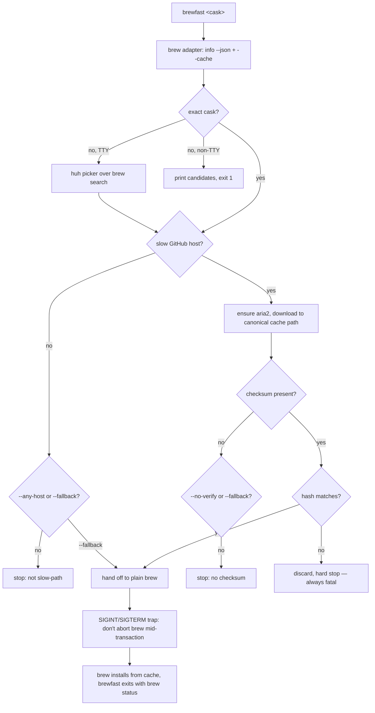

# brewfast - Plan

## Goal Capsule

- **Objective:** Ship an open-source Go CLI that accelerates Homebrew **cask** installs/upgrades whose downloads come from throttled GitHub release assets — fetch with `aria2` parallel connections, verify against the cask's checksum, place the file in brew's cache, then hand off to `brew` for the install. This plan owns the v1 tool and its distribution; it does not own any future brew-native alias or global download interception.
- **Product authority:** Amit Ray. Distribution lands in the existing `amitray007/homebrew-tap` (local checkout: `/Users/maverick/code/projects/homebrew-tap`), modeled on the `ccstack` Go-CLI-as-formula pattern already in that tap.
- **Open blockers:** None. The brainstorm's deferred questions (fuzzy matching, self-update mechanism, host detection, brew invocations) are resolved in the Planning Contract KTDs, grounded in live-verified `brew` commands. Two minor styling/filtering details are deferred to implementation.

---

## Product Contract

### Summary

brewfast is a standalone CLI you run instead of `brew` when a cask's download is slow. It resolves the cask, downloads the asset with `aria2` parallel connections (~3× faster on GitHub-throttled assets), verifies the checksum against the cask definition, places the verified file into Homebrew's download cache under the name brew expects, then shells out to `brew` to perform the real install. brew remains the source of truth; brewfast is a pre-fetch optimizer that never wedges it.

### Problem Frame

Homebrew serves cask app downloads (DMGs, large archives) that are frequently hosted as **GitHub release assets**. GitHub throttles those assets to roughly 1 MB/s per connection with no CDN edge in front, so a 200MB app DMG takes minutes and `brew upgrade` can time out. The throttle is per-connection, so parallel range requests recover multiples of that speed — measured at ~2.9 MB/s vs ~0.95 MB/s (about 3×) on a real 201MB nightly DMG. Homebrew exposes no built-in parallel-download or download-strategy override for this case, so today the only recourse is a manual `aria2` → checksum → cache-placement dance. brewfast turns that proven manual procedure into one reliable command.

### Key Decisions

- **Standalone accelerator, not a brew shim (Approach A).** brewfast is its own command that fronts `brew` and hands off; it does not intercept brew's global download path. (session-settled: user-directed — chosen over a `HOMEBREW_CURL_PATH` shim and a `brew fast` external command: transparency and zero risk of wedging core brew for a trust-sensitive tool a general audience installs.)
- **General OSS tool for anyone, not a personal accelerator.** Design targets any Homebrew user with slow GitHub-asset casks, raising the bar on unknown-cask handling, trust, and discoverability. (session-settled: user-directed — chosen over "personal tool, OSS-shaped" and "prove the mechanism first".)
- **Default posture: accelerate or stop with a clear error.** No silent fallback and no unverified installs by default. Fallback to plain `brew` is opt-in via `--fallback`. (session-settled: user-directed — chosen over silent-fallback-by-default: someone who typed `brewfast` wanted the fast path; silently substituting a slow plain-brew install defeats the intent, so brewfast explains why it can't help and lets the user decide.)
- **Checksum mismatch is always fatal.** A downloaded file whose hash differs from the cask's checksum is discarded and hard-stops even under `--fallback` — a mismatch signals a corrupt or truncated transfer, not "can't accelerate." Only `--no-verify` (skip checking entirely) bypasses the check. Scope of the guarantee: because both the url and the expected `sha256` come from the same `brew info` cask definition, this check gives brewfast **integrity parity with brew** — the accelerated download is byte-identical to what brew would have installed — not independent authenticity. brewfast inherits, and does not widen, brew's trust in the cask and tap. TLS on the download (see R1/security) is the other required leg.
- **Flags make posture per-run configurable.** Sensible safe defaults with power-user overrides, rather than one fixed posture. (session-settled: user-directed.)
- **Polished, modern CLI feel — Clack-style prompts.** The interactive picker and general CLI presentation aim for the `@clack/prompts` aesthetic (clean framed prompts, arrow-key selection, cancel handling), not a bash-`read` feel. (session-settled: user-directed.)
- **Casks only.** Formula/bottle downloads come CDN-fast from ghcr.io and are out of scope; the slow-path problem is specific to large cask assets on GitHub.

### Requirements

**Core command**

- R1. `brewfast <cask>` accelerates the install or upgrade of a named cask by downloading its asset with `aria2` parallel connections, verifying the checksum, placing the file in brew's download cache, then handing off to `brew` for the install.
- R2. brewfast computes the cache filename brew expects from `brew`'s own cache-path resolution for that cask rather than hardcoding the naming scheme, and places the verified file there so `brew` reuses it without re-downloading.
- R3. brewfast verifies the downloaded file against the cask's declared `sha256` before handoff.
- R4. An exact cask-name match always proceeds without prompting, in any environment.

**Safety and posture**

- R5. By default, when the fast path does not cleanly apply — the download host is not a slow GitHub-asset host, the cask declares no checksum, or verification fails — brewfast stops with a clear, specific error naming the reason and the relevant override flag, and does not install.
- R6. A checksum mismatch (downloaded file's hash differs from the cask's declared checksum) is always fatal: brewfast discards the file and stops, even when `--fallback` is set. Only `--no-verify` bypasses checksum handling.
- R7. `--fallback` makes brewfast hand off to plain `brew` on any non-fatal snag (non-slow host, missing checksum) instead of erroring, so scripts and CI can request "install by any means."
- R8. `--any-host` permits parallel downloading from hosts other than the recognized slow GitHub-asset hosts.
- R9. `--no-verify` skips checksum verification entirely (for casks with no checksum, or when the user knowingly accepts the risk).
- R10. `--force` attempts the fast path even in cases the default would refuse.
- R11. brewfast is never worse than `brew`: any path that does not accelerate either hands off to a correct `brew` install (with `--fallback`) or stops without leaving a partial or unverified install in place.

**Name resolution**

- R12. When the given name has no exact cask match and an interactive terminal is present, brewfast presents a Clack-style interactive picker of near-matching casks for the user to choose from.
- R13. When the given name has no exact cask match and no interactive terminal is present, brewfast prints the candidate matches and exits non-zero without prompting, so it never hangs a CI job.
- R14. `--yes` / `--no-input` force non-interactive behavior even in a terminal, taking the R13 path instead of the picker.

**Subcommands**

- R15. `brewfast upgrade` self-updates the brewfast tool via its Homebrew tap.
- R16. `brewfast doctor` diagnoses the local setup — presence of `brew` and `aria2`, terminal/TTY detection, and relevant configuration — and reports what is wrong and how to fix it.
- R17. `brewfast --version` and `brewfast --help` report version and usage.

**Dependencies and first-run**

- R18. When `aria2` is not present, brewfast installs it (via `brew install aria2`) before proceeding.
- R19. When brewfast is invoked on a cask whose download is already CDN-fast (not a recognized slow GitHub-asset host), the message makes clear that brewfast only accelerates slow GitHub-asset casks and that this is expected behavior, not a failure — so a first-time user does not read it as broken. This message names `--any-host` and `--fallback` as the paths forward.

**Distribution and platforms**

- R20. brewfast is distributed through `amitray007/homebrew-tap` as a Homebrew formula, installable via `brew install`, modeled on the existing `ccstack` formula pattern (multi-arch tarballs published to tap releases, formula auto-rendered by CI, not hand-edited).
- R21. Release CI builds cross-platform binaries (macOS and Linux, arm64 and x64), publishes them as release assets, and updates the formula automatically, modeled on the `amitray007/orpheus` release pipeline.
- R22. brewfast builds and runs on macOS and Linux (arm64 and x64), matching the `ccstack` target matrix, even though the slow-cask problem is macOS-centric in practice.

**Transaction safety and hygiene**

- R23. Once the `brew` handoff has begun, brewfast must not leave `brew` mid-transaction if brewfast is interrupted (SIGINT, SIGTERM, or SIGHUP on terminal close). brewfast starts `brew` in its own process group so a terminal-delivered Ctrl-C reaches only brewfast, not `brew` directly; it traps those signals, declines to abort the in-flight install, prints that brew is installing and will not be interrupted, and exits only after `brew` completes. A second deliberate interrupt, or SIGKILL, may still force termination at the OS level; this is documented, not silently swallowed.
- R24. `brewfast doctor` detects a stuck cask transaction — a `Caskroom/<token>/<version>/` directory present while `Caskroom/<token>/.metadata/INSTALL_RECEIPT.json` is absent and the installed artifact is missing or empty — and offers the mechanical recovery (clear the stuck marker, reinstall from the cached download with `--force`).
- R25. brewfast writes the accelerated download directly to `brew`'s canonical cache filename (from `brew --cache --cask <name>`) rather than downloading to a separate name and copying, so it never leaves a duplicate asset in the cache. `doctor` may additionally offer to sweep orphaned non-canonical download files, never touching brew's own version-named symlinks.

**Feedback and discoverability**

- R26. On the happy path, brewfast surfaces a concise success signal that the fast path was taken and the throughput/elapsed achieved, so the user can tell acceleration actually happened. A quiet/scriptable mode suppresses it for non-interactive consumers.
- R27. `brewfast check <cask>` reports, without installing, whether brewfast can accelerate that cask (slow GitHub-asset host vs already-fast, checksum present) — letting a user learn applicability before committing to an install.
- R28. The README opens with a one-screen positioning statement — what brewfast accelerates and the one-line why (GitHub release-asset throttling) — so a stranger who finds the tap understands the tool's purpose and applicability immediately.

### Key Flows

- F1. Happy path — accelerate and hand off
  - **Trigger:** `brewfast orpheus-nightly` with an exact match, slow GitHub-asset host, valid checksum.
  - **Steps:** Resolve cask → confirm host is a slow-path host → ensure `aria2` present (install if missing) → download asset with parallel connections → verify against cask `sha256` → place file at brew's expected cache path → invoke `brew` to install from cache (no re-download).
  - **Outcome:** Cask installed/upgraded, checksum-verified, materially faster than plain `brew`.
  - **Covered by:** R1, R2, R3, R18, R20

- F2. Inexact name, interactive terminal
  - **Trigger:** `brewfast orpheus` (no exact cask) in a TTY.
  - **Steps:** No exact match found → gather near-matching casks → present Clack-style picker → user selects → proceed as F1 with the chosen cask.
  - **Outcome:** User reaches the intended cask without brewfast guessing.
  - **Covered by:** R12, R4

- F3. Inexact name, non-interactive
  - **Trigger:** `brewfast orpheus` (no exact cask) in CI / piped / `--no-input`.
  - **Steps:** No exact match → print candidate list → exit non-zero. No prompt.
  - **Outcome:** Script fails fast with actionable output rather than hanging.
  - **Covered by:** R13, R14

- F4. Fast path does not apply
  - **Trigger:** Cask on a non-GitHub host, or a cask with no declared checksum.
  - **Steps (default):** brewfast stops with a specific error naming the reason and the relevant flag (`--any-host`, `--no-verify`, or `--fallback`).
  - **Steps (`--fallback`):** brewfast hands off to plain `brew` and the user gets a correct, slower install.
  - **Outcome:** No silent slow install; no unverified install; user chooses the next step.
  - **Covered by:** R5, R7, R8, R9, R19

- F5. Verification failure
  - **Trigger:** Downloaded file's hash differs from the cask's checksum.
  - **Steps:** Discard the downloaded file → hard stop with a mismatch error, regardless of `--fallback`. (Only a prior `--no-verify` would have skipped the check entirely.)
  - **Outcome:** A corrupt or tampered download is never installed.
  - **Covered by:** R6, R11

- F6. Interrupt during handoff
  - **Trigger:** User presses Ctrl-C (or a timeout sends SIGTERM) after `brew` handoff has started.
  - **Steps:** brew runs in its own process group so the TTY interrupt reaches only brewfast → brewfast's signal trap catches it → it does not forward a kill to the `brew` child and does not exit → prints that brew is mid-install and will finish → on a second interrupt, notes that forcing may corrupt the transaction → after `brew` returns, brewfast exits with brew's status.
  - **Outcome:** A single interrupt never leaves a half-completed brew transaction — the exact failure mode from the originating incident.
  - **Covered by:** R23, R11

- F7. Doctor recovers a stuck transaction
  - **Trigger:** `brewfast doctor` runs after a prior install was killed mid-transaction.
  - **Steps:** Scan Caskroom for the stuck signature (version dir present, no `INSTALL_RECEIPT.json`, empty/missing installed app) → report the affected cask → offer the mechanical fix (clear the stuck marker, `reinstall --force` from the cached download) → optionally sweep orphaned non-canonical cache files.
  - **Outcome:** A wedged cask is recovered without the user hand-diagnosing Caskroom internals.
  - **Covered by:** R24, R16, R25

### Acceptance Examples

- AE1. Covers R1, R2, R3. **Given** an exact cask on a slow GitHub-asset host with a valid `sha256`, **when** `brewfast <cask>` runs, **then** the asset is downloaded in parallel, verified, placed in brew's cache, and `brew` installs from cache without re-downloading.
- AE2. Covers R5. **Given** a cask whose download host is not a recognized slow GitHub-asset host, **when** `brewfast <cask>` runs with no flags, **then** brewfast exits non-zero with a message naming the host reason and suggesting `--any-host` or `--fallback`, and nothing is installed.
- AE3. Covers R6. **Given** a downloaded file whose hash does not match the cask's `sha256`, **when** verification runs, **then** the file is discarded and brewfast hard-stops with a mismatch error even if `--fallback` was passed.
- AE4. Covers R5, R9. **Given** a cask that declares no checksum, **when** `brewfast <cask>` runs with no flags, **then** brewfast stops and names `--no-verify` or `--fallback`; **and when** re-run with `--no-verify`, **then** it accelerates without checksum verification.
- AE5. Covers R12, R13, R14. **Given** an inexact name, **when** run in a TTY, **then** the Clack-style picker appears; **when** run without a TTY or with `--no-input`, **then** candidates are printed and the process exits non-zero without prompting.
- AE6. Covers R7. **Given** any non-fatal snag (non-slow host or missing checksum) **and** `--fallback` is set, **when** `brewfast <cask>` runs, **then** brewfast hands off to plain `brew` and the cask installs correctly.
- AE7. Covers R18. **Given** `aria2` is not installed, **when** `brewfast <cask>` runs, **then** brewfast installs `aria2` before downloading.
- AE8. Covers R23. **Given** `brew` handoff has begun, **when** brewfast receives a single SIGINT, **then** the in-flight `brew` install is not interrupted, brewfast reports it is finishing, and brewfast exits only after `brew` returns.
- AE9. Covers R24. **Given** a Caskroom entry with a version directory but no `INSTALL_RECEIPT.json` and no installed app, **when** `brewfast doctor` runs, **then** it reports the stuck transaction and offers to clear the marker and reinstall from cache.
- AE10. Covers R25. **Given** an accelerated download, **when** brewfast fetches the asset, **then** the file is written to the exact path from `brew --cache --cask <name>` and no duplicate download file remains.

### Scope Boundaries

**Deferred for later (not v1):**
- A `brew fast <cask>` brew-native alias (registering a `brew-fast` external command from the same binary). Noted as a cheap future nicety, not v1 scope.
- Accelerating any download type beyond casks.
- A brewfast nightly channel of its own. v1 ships a stable channel only.

**Deferred to Follow-Up Work:**
- Full process-detachment of the `brew` child (running it in its own process group so even SIGKILL of brewfast cannot orphan-kill it). v1 ships trap-and-finish (R23); detachment is a later hardening step.

**Outside this product's identity:**
- Global download interception via a `HOMEBREW_CURL_PATH` shim (Approach C). Explicit non-goal: it intercepts every brew download machine-wide, is an invisible cause when something breaks later, and directly contradicts the no-silent-behavior default. A future contributor should not add it.
- A TUI. brewfast is a CLI; interactivity is limited to the name-resolution picker.
- Accelerating Homebrew formula/bottle downloads (ghcr.io is already CDN-fast).

### Dependencies / Assumptions

- Depends on `brew` being installed and on the machine (brewfast fronts it and reads its cache-path resolution).
- Depends on `aria2` (auto-installed via `brew` when absent — R18).
- The load-bearing integration point — deriving brew's cache path and a cask's url/checksum — is resolved (see Planning Contract KTD-2). `brew --cache --cask <name>`, `brew info --json=v2 --cask <name>`, and `brew search <name>` were verified live against Homebrew 6.0.13.
- Assumes the set of "slow" hosts is primarily GitHub release-asset hosts — `github.com/*/releases/download/*` URLs and their `release-assets.githubusercontent.com` redirect targets. The exact matcher is KTD-4.
- Distribution assumes continued use of `amitray007/homebrew-tap` and the `ccstack` CI pattern already present there.

### Outstanding Questions

All product- and planning-blocking questions from the requirements brainstorm are resolved (see Planning Contract KTDs). No open blockers remain.

**Deferred to Implementation:**
- Exact `huh` theme values to match the `@clack/prompts` look — a styling detail settled while building the picker.
- Whether `brew search` output needs post-filtering to drop formulae from cask candidates, determined against real `brew search` output during implementation.

### Sources / Research

- `Formula/ccstack.rb` in `amitray007/homebrew-tap` — the Go-CLI-as-formula template to model brewfast's formula on (multi-arch tarballs, auto-rendered formula, offline `test do` block).
- `.github/workflows/release.yml` + `release-please.yml` in `amitray007/ccstack` — the reference CLI release pipeline (GOOS/GOARCH matrix, tarball + `SHA256SUMS`, rendered formula, direct commit/push to the tap's `main` with `HOMEBREW_TAP_TOKEN`). `amitray007/orpheus` `nightly.yml` is the reference only for the nightly pattern, deferred here.
- Grounding dossier (this session): CI extraction + live-verified brew commands at `/Users/maverick/.claude/jobs/d1adada0/tmp/brewfast-ci-dossier.md`.
- Measured speedup baseline: ~0.95 MB/s single-connection vs ~2.9 MB/s with `aria2 -x16` on a 201MB GitHub-hosted nightly DMG (~3×), verified against a real cask checksum before install — the empirical basis for the Problem Frame.

**Product Contract preservation:** changed — added R23–R25 (transaction safety/hygiene, from the originating incident) plus flows F6/F7 and AE8–AE10; added R26–R28 (success signal, `check` dry-run, README positioning, from document review) and reframed the checksum decision as integrity-parity not authenticity. Existing R1–R22 and their flows/AEs unchanged.

---

## Planning Contract

### Key Technical Decisions

- KTD-1. **Cobra for the command tree; `charmbracelet/huh` for the interactive picker.** Cobra gives the `<cask>` / `upgrade` / `doctor` subcommands, `--version`, `--help`, and flag parsing in the shape most Go CLIs (and this tap's siblings) already use. `huh`'s `Select` provides the `@clack/prompts`-style framed, arrow-key, cancelable picker with a first-class accessible mode — the polished feel R12 requires — without hand-building a TTY UI. (session-settled: user-approved — chosen over a bespoke `read`-style prompt: the user asked for a Clack-style modern CLI.)
- KTD-2. **brew is the source of truth for url, checksum, and cache path — read via structured commands, never scraped.** `brew info --json=v2 --cask <name>` yields `url`, `sha256`, `version`, `token` in one call; `brew --cache --cask <name>` yields the absolute canonical cache path (the `sha256(url)--filename` scheme, derived not reconstructed). Both verified live against Homebrew 6.0.13. This is the load-bearing integration seam and a stable, machine-readable interface.
- KTD-2b. **Cache reuse is conditional on brew's freshness re-validation, and brewfast must satisfy it — placement alone is not sufficient.** On handoff, brew's download strategy issues a live HEAD and reuses the cached file only when its size equals the asset's `Content-Length` and its mtime is not older than the asset's `Last-Modified`; otherwise brew silently re-downloads the full body at the throttled speed — defeating brewfast with no error and violating R11 invisibly. brewfast therefore must: (a) write the complete asset so size matches (a verified full download does), (b) leave the file's mtime at download time and never back-date it to the server `Last-Modified`, and (c) after placement, assert brew actually reuses the file (expects the "Already downloaded" path, not a re-fetch) as a happy-path verification. Also run the handoff with `HOMEBREW_NO_AUTO_UPDATE=1` and re-read `brew --cache --cask` immediately before handoff, so a tap refresh cannot move the canonical path (a new cask version) out from under the placed file between read and install.
- KTD-3. **Delegate near-name matching to `brew search <name>`; do not hand-roll a fuzzy algorithm.** `brew search` already returns near matches (`orpheus` → `morpheus`, `orpheus`, `orpheus-nightly`), verified live. brewfast filters that output to casks and feeds it to the picker (TTY) or the candidate list (non-TTY). This resolves the brainstorm's deferred fuzzy-algorithm question with zero custom matching code. (session-settled: user-approved — chosen over a Levenshtein/custom matcher.)
- KTD-4. **Slow-host detection matches GitHub release-asset URLs and their redirect target.** A host is "slow-path" when the cask `url` is a `github.com/<owner>/<repo>/releases/download/...` asset (or resolves through `release-assets.githubusercontent.com`). Anything else is "already fast" and, by default, triggers the R5 stop with the R19 first-impression message. `--any-host` overrides.
- KTD-5. **Self-update wraps `brew upgrade brewfast` against the tap.** `brewfast upgrade` shells `brew update` + `brew upgrade brewfast` and reports cleanly when already current, rather than shipping a bespoke binary self-replace. brewfast is installed from the tap, so this is the same mechanism every sibling formula already uses. (session-settled: user-approved — chosen over direct self-replace: simpler, consistent, no signing/permission surface.)
- KTD-6. **Handoff starts `brew` in its own process group and traps SIGINT/SIGTERM/SIGHUP so the interrupt cannot abort mid-transaction (R23).** A terminal Ctrl-C is delivered by the TTY to the whole foreground process group, so a same-group `brew` child would be killed by the kernel regardless of what brewfast's own handler does — the trap alone is not enough. brewfast therefore launches `brew` with `SysProcAttr{Setpgid: true}` (its own group), then installs a handler that swallows the first interrupt, keeps the child running to completion, prints that brew is finishing, and exits with brew's status. This process-group split is the mechanism that makes trap-and-finish actually work for interactive Ctrl-C, and it directly closes the incident's root cause. Full daemon-style detachment (surviving SIGKILL of brewfast) remains deferred.
- KTD-7. **Accelerate by writing aria2's output directly to brew's canonical cache filename (R25).** brewfast resolves the cache path from `brew --cache --cask` first, then points `aria2c -o` at that exact name — no download-then-copy, so no duplicate 201MB asset is left behind (the litter observed during the incident).
- KTD-8. **Distribution models `ccstack`, not `orpheus`.** brewfast is a CLI-as-Formula (multi-arch `.tar.gz` + `SHA256SUMS` + rendered `Formula/brewfast.rb`), released via release-please on `push: main` → reusable `release.yml`, which builds the GOOS/GOARCH matrix, publishes assets to the public tap's Releases, renders the formula from a placeholder template, and commits/pushes it directly to the tap's `main` with `HOMEBREW_TAP_TOKEN`. The tap accepts no PRs; formulae are auto-generated. `orpheus` is the reference only for the (deferred) nightly pattern.

### High-Level Technical Design

The core is a linear pipeline with two decision gates (host, verify) and a signal-guarded handoff. `doctor` and `upgrade` are separate entry points that reuse the brew adapter.



Prose remains authoritative where it and the diagram could diverge: the flow gates are specified by R5–R11 and F1–F7 above; the diagram is an on-ramp.

---

## Output Structure

```text
brewfast/
├── go.mod
├── main.go                      # thin entry → cmd.Execute()
├── cmd/
│   ├── root.go                  # cobra root, global flags, version
│   ├── install.go               # default: brewfast <cask>
│   ├── check.go                 # dry-run applicability report
│   ├── upgrade.go               # self-update
│   └── doctor.go                # diagnostics + stuck-transaction recovery
├── internal/
│   ├── brew/                    # brew adapter: info-json, cache-path, search, handoff
│   │   ├── brew.go
│   │   └── brew_test.go
│   ├── accel/                   # aria2 download + checksum verify
│   │   ├── accel.go
│   │   └── accel_test.go
│   ├── host/                    # slow-host detection
│   │   ├── host.go
│   │   └── host_test.go
│   ├── resolve/                 # name resolution + huh picker + TTY detection
│   │   ├── resolve.go
│   │   └── resolve_test.go
│   └── handoff/                 # signal-guarded brew child (R23)
│       ├── handoff.go
│       └── handoff_test.go
├── .github/workflows/
│   ├── ci.yml                   # build/test/vet on PR
│   ├── release-please.yml       # push:main → Release PR → publish
│   └── release.yml              # reusable: build matrix + tap push
├── scripts/
│   ├── brewfast-formula.template.rb
│   └── render-formula.*         # placeholder → Formula/brewfast.rb
└── README.md
```

The tree is a scope declaration; per-unit `**Files:**` are authoritative.

---

## Implementation Units

### U1. brew adapter — structured reads and handoff surface

- **Goal:** One package that wraps every `brew` interaction brewfast needs: fetch a cask's `url`/`sha256`/`version`/`token` (`brew info --json=v2 --cask`), resolve the canonical cache path (`brew --cache --cask`), list near-name candidates (`brew search`), and run the install/upgrade handoff — plus detect `brew` and `aria2` presence.
- **Requirements:** R1, R2, R3, R12, R18 (detection); grounds KTD-2, KTD-3.
- **Dependencies:** none (foundation).
- **Files:** `internal/brew/brew.go`, `internal/brew/brew_test.go`.
- **Approach:** Validate the cask name against Homebrew's token grammar (lowercase alphanumerics, `-`, `@`, `+`, `.`) and reject anything else at this boundary — this stops a leading-dash name (`--version`, an `aria2c` option) from being parsed as a flag by a downstream tool. Shell out to `brew` and parse `--json=v2` with `encoding/json` into a typed struct. Every invocation uses explicit args with a `--` terminator before the name. Expose `CaskInfo(name)`, `CachePath(name)`, `SearchCandidates(name)`, `IsInstalled(brew/aria2)`. `SearchCandidates` parses `brew search` **stdout** (section markers, tap-qualified `owner/tap/<cask>` lines) and treats an empty parsed set as "no candidates" regardless of exit code — `brew search` prints "No formulae or casks found" to stderr but exits 0, so exit status is not a reliable no-match signal. Keep the handoff call (`brew reinstall/upgrade --cask`) behind an interface so U6 wraps it with signal handling. No business logic here — this is the seam other units build against, so it lands first and solo.
- **Patterns to follow:** mirror how the tap's sibling Go CLIs shell out; standard `os/exec` with explicit args (never a shell string) and a `--` terminator before user-derived values.
- **Test scenarios:** Covers AE1. Parse a captured `brew info --json=v2` fixture → correct url/sha/version/token. Cache-path call returns the absolute `sha256--filename` path. `SearchCandidates` filters `brew search` fixture output to casks only. No-match fixture (stderr "No formulae or casks found", exit 0) → zero candidates. Leading-dash name (`--version`) → rejected by grammar validation before any exec. Missing-cask name → typed not-found error. `brew` absent → clear error. `aria2` presence check true/false.
- **Verification:** Package compiles; adapter returns correct fields against real `brew info --json=v2 --cask orpheus-nightly`.

### U2. Slow-host detection

- **Goal:** Decide whether a cask's download URL is a throttled GitHub release asset (slow-path) or already CDN-fast.
- **Requirements:** R5, R8, R19; implements KTD-4.
- **Dependencies:** U1 (consumes `CaskInfo.url`).
- **Files:** `internal/host/host.go`, `internal/host/host_test.go`.
- **Approach:** Pure function `IsSlowHost(url) bool` matching `github.com/<owner>/<repo>/releases/download/...` and the `release-assets.githubusercontent.com` redirect host. Require the scheme to be `https` — a non-https url is never a slow-path candidate and callers treat it as a hard error, not a silent fall-through (the download must be TLS-authenticated). Pure and table-driven — no I/O.
- **Patterns to follow:** standard-library `net/url` parsing; table-driven Go tests.
- **Test scenarios:** Covers AE2. GitHub release-asset https URL → slow. `release-assets.githubusercontent.com` https URL → slow. A vendor CDN URL (e.g. `dl.example.com`) → not slow. `github.com` non-release URL → not slow. `http://` GitHub release URL → not slow-path (scheme rejected). Malformed URL → not slow, no panic.
- **Verification:** `go test ./internal/host` green with the table covering GitHub, redirect host, and non-GitHub CDNs.

### U3. Accelerated download + checksum verification

- **Goal:** Download an asset with `aria2` parallel connections straight to brew's canonical cache path, then verify it against the cask checksum.
- **Requirements:** R1, R2, R3, R6, R25; implements KTD-7.
- **Dependencies:** U1 (cache path + aria2 presence).
- **Files:** `internal/accel/accel.go`, `internal/accel/accel_test.go`.
- **Approach:** Reject a non-`https` url up front (a downgrade or `http` asset is a hard error — see U2/security), then resolve the canonical cache path from U1 and invoke `aria2c --check-certificate=true -x16 -s16 -k1M -c -o <canonical-name> -d <cache-dir> -- <url>` writing directly to the final name (no copy — R25). After a successful transfer, delete the `<canonical-name>.aria2` control sidecar; compute SHA-256 and compare to the cask's declared value. On mismatch, discard both the file and its `.aria2` sidecar and return a fatal error the caller must not recover from (R6). Leave the placed file's mtime at write time (do not back-date to server `Last-Modified`) so brew's freshness gate reuses it (KTD-2b). `aria2 -c` gives resumable/interrupted-download safety.
- **Execution note:** Verify checksum before the file is ever eligible for handoff; a mismatch deletes the partial and its sidecar and returns fatal even under `--fallback`.
- **Patterns to follow:** `crypto/sha256` streaming over the file; `os/exec` with explicit args and a `--` argument terminator before any user-derived value.
- **Test scenarios:** Covers AE1, AE3, AE10. Matching hash → success, file at the exact canonical path, no sibling duplicate and no leftover `.aria2` sidecar. Mismatched hash → file and sidecar removed, fatal error. Download written directly to the `brew --cache` name (assert no second file). Missing checksum input → returns the "no checksum" sentinel (posture decided by U4), not a silent pass. Non-https url → hard error before any download.
- **Verification:** Unit tests green with a small fixture file and known-good/known-bad hashes.

### U4. Posture, flags, and the install command wiring

- **Goal:** Assemble the default `brewfast <cask>` flow, the root command (`--version`/`--help`), aria2 ensure-install, and the flag-driven posture: default accelerate-or-stop, `--fallback`, `--any-host`, `--no-verify`, `--force`, `--yes`/`--no-input`.
- **Requirements:** R1, R5, R6, R7, R8, R9, R10, R11, R17, R18 (install), R19, R26.
- **Dependencies:** U1, U2, U3, U5 (resolution), U6 (handoff).
- **Files:** `cmd/install.go`, `cmd/root.go`.
- **Approach:** `cmd/root.go` wires the Cobra root, persistent flags (including `--quiet`), and `--version`/`--help` (R17). The install flow orchestrates the F1/F4/F5 pipeline: resolve name (U5) → host gate (U2) → ensure aria2 present, running `brew install aria2` with a one-line notice when absent (R18 install half) → download/verify (U3) → hand off (U6, with `HOMEBREW_NO_AUTO_UPDATE=1` and a pre-handoff cache-path re-read per KTD-2b). Each non-happy branch consults the posture flags and either stops with a specific, flag-naming error (default) or falls back (`--fallback`). Verify-mismatch is always fatal regardless of flags. When `--no-verify` is in effect, print an unmissable stderr warning naming the cask, url, and host, and include an "installed unverified" note on the success line so the fact is never silent. On the happy path, print a concise success line reporting fast-path-taken and achieved throughput/elapsed (R26), suppressed under `--quiet`/non-TTY. Emit the R19 first-impression message on **both** default-stop paths — already-fast-host and no-checksum — framing each as expected behavior, not a failure. If `brew install aria2` fails, stop with a clear error naming the manual command; touch nothing else.
- **Patterns to follow:** Cobra command with persistent flags on root; error values from U1–U3 mapped to exit codes + messages.
- **Test scenarios:** Covers AE2, AE4, AE6, AE7. `--version`/`--help` output asserted. Non-slow host, no flags → exit non-zero, R19-framed message names `--any-host`/`--fallback`, nothing installed. Non-slow host + `--fallback` → plain-brew handoff invoked. No checksum, no flags → R19-framed stop naming `--no-verify`/`--fallback`; with `--no-verify` → proceeds AND emits the unverified warning. `--any-host` on a non-slow host → proceeds to accelerate (positive override path). Mismatch + `--fallback` → still fatal (asserts R6 beats fallback). aria2 absent → `brew install aria2` invoked with notice; its failure → clear manual-command error.
- **Verification:** Table-driven test over the flag matrix asserts the chosen branch (stop / fallback / accelerate) per combination, including the `--any-host` and `--no-verify` positive paths.

### U5. Name resolution + Clack-style picker + TTY awareness

- **Goal:** Turn an inexact cask name into a chosen cask — interactive `huh` picker in a TTY, printed candidates + non-zero exit otherwise.
- **Requirements:** R4, R12, R13, R14; implements KTD-1, KTD-3.
- **Dependencies:** U1 (`SearchCandidates`).
- **Files:** `internal/resolve/resolve.go`, `internal/resolve/resolve_test.go`.
- **Approach:** Exact match → return immediately (R4). Otherwise gather candidates (U1) and branch on `isatty(stdin)` and `--yes`/`--no-input`: TTY → `huh.NewSelect` themed to a Clack-like look, with cancel handling; non-TTY or forced → print candidates, return a non-zero sentinel (never block — R13). Keep the picker behind an interface so tests inject a fake selector.
- **Patterns to follow:** `charmbracelet/huh` `Select`; `golang.org/x/term.IsTerminal` for TTY detection.
- **Test scenarios:** Covers AE5. Exact name → no candidate gathering, proceeds. Inexact + fake-TTY → selector invoked, choice returned. Inexact + non-TTY → candidates printed, non-zero, selector never called (asserts no hang). `--no-input` in a TTY → takes the non-TTY branch.
- **Verification:** Tests green with an injected selector; manual TTY smoke shows the framed picker.

### U6. Signal-guarded handoff

- **Goal:** Run the `brew` install/upgrade child so a single interrupt to brewfast never leaves brew mid-transaction.
- **Requirements:** R23, R11; implements KTD-6. Covers F6.
- **Dependencies:** U1 (handoff interface).
- **Files:** `internal/handoff/handoff.go`, `internal/handoff/handoff_test.go`.
- **Approach:** Start `brew` via `os/exec` with `SysProcAttr{Setpgid: true}` so it runs in its own process group and a TTY-delivered SIGINT no longer reaches it. Install a `signal.Notify` handler for SIGINT/SIGTERM/SIGHUP that, on first receipt, does NOT forward a kill to the child — it prints "brew is installing; not interrupting (press again to force, may corrupt)" and keeps waiting on the child. On a second interrupt, allow default termination. Return the child's exit status. Full daemon-style detachment (SIGKILL survival) is deferred.
- **Execution note:** Start with a failing test that delivers the signal to brewfast's process group (not just its PID) during a fake long-running child, asserting the child is not killed — a PID-only test would pass while the real TTY path fails.
- **Patterns to follow:** `os/exec.Command` with `SysProcAttr{Setpgid: true}`; `os/signal` with a buffered channel; do not use `CommandContext` cancel-on-signal.
- **Test scenarios:** Covers AE8. Fake child runs N ms; SIGINT delivered to the process group mid-run → child observed to complete, brewfast returns child status. SIGHUP mid-run → same. Second SIGINT → default termination. Clean run, no signal → exit status forwarded.
- **Verification:** `go test ./internal/handoff` green; manual: Ctrl-C during a real slow install does not wedge the cask.

### U7. `doctor` — diagnostics and stuck-transaction recovery

- **Goal:** `brewfast doctor` reports environment health and detects/repairs a stuck cask transaction and orphaned cache files.
- **Requirements:** R16, R24, R25 (orphan sweep). Covers F7.
- **Dependencies:** U1.
- **Files:** `cmd/doctor.go`.
- **Approach:** Health section: `brew` present, `aria2` present, stdin TTY, tap reachable. Recovery section: scan `$(brew --prefix)/Caskroom/<token>/` entries for the stuck signature — a `<token>/<version>/` directory present while `<token>/.metadata/INSTALL_RECEIPT.json` is absent and the installed artifact is missing/empty — report affected casks and offer the mechanical fix (clear the stuck marker, `brew reinstall --force --cask <name>` from cache). Orphan sweep (optional, offered not automatic): list only **regular files** (never symlinks) in the downloads dir whose name lacks the `[0-9a-f]{64}--` prefix and are not the current canonical name for any cask, plus stray `.aria2` control sidecars — explicitly excluding brew's own `<name>--<version>.<ext>` symlinks (brew maintains these; deleting them removes brew state).
- **Patterns to follow:** read-only by default; any mutation is offered, not automatic (honor the global operating manual's read-only-by-default posture).
- **Test scenarios:** Covers AE9. Fixture Caskroom tree with `<token>/<version>/` + no `<token>/.metadata/INSTALL_RECEIPT.json` + no app → detected as stuck. Healthy tree (receipt present at token/.metadata) → not flagged. aria2/brew/TTY checks report correctly. Orphan sweep lists a genuine stray regular file and a leftover `.aria2` sidecar, and leaves brew's version-named symlink and all canonical hashed files intact.
- **Verification:** `brewfast doctor` on a clean machine reports all-green; on a synthetically wedged Caskroom fixture it identifies the stuck cask.

### U8. `upgrade` self-update

- **Goal:** `brewfast upgrade` updates brewfast itself via the tap.
- **Requirements:** R15; implements KTD-5.
- **Dependencies:** U1.
- **Files:** `cmd/upgrade.go`.
- **Approach:** Run `brew update` then `brew upgrade brewfast`; detect and report the already-current case cleanly rather than as an error.
- **Test scenarios:** Already-current output → reports current, exit 0. Upgrade-available path → invokes `brew upgrade brewfast`. `brew` absent → clear error.
- **Verification:** `brewfast upgrade` reports current on a machine already on latest.

### U9. Distribution — formula template + release CI

- **Goal:** Ship brewfast through `amitray007/homebrew-tap` with automated cross-platform releases modeled on `ccstack`, plus a README that opens with clear positioning.
- **Requirements:** R20, R21, R22, R28; implements KTD-8.
- **Dependencies:** U1–U8 (a buildable binary with `--version`/`--help`).
- **Files:** `.github/workflows/ci.yml`, `.github/workflows/release-please.yml`, `.github/workflows/release.yml`, `scripts/brewfast-formula.template.rb`, `scripts/render-formula.*`, `README.md`.
- **Approach:** CI builds/tests/vets on PR. `release-please` on `push: main` opens a Release PR; on merge, the reusable `release.yml` builds the GOOS/GOARCH matrix (`darwin/arm64`, `darwin/amd64`, `linux/arm64`, `linux/amd64`), packages reproducible `brewfast-<version>-<os>-<arch>.tar.gz` tarballs + a single `SHA256SUMS`, publishes them to the public tap's Releases under tag `brewfast-v<version>`, renders `Formula/brewfast.rb` from the placeholder template, and commits/pushes it directly to the tap's `main` using `HOMEBREW_TAP_TOKEN`. The formula carries the offline `test do` (`--version` equals version; `--help` matches `brewfast`).
- **Execution note:** This is packaging/CI — prefer a dry-run of the release workflow and a `brew install --build-from-source`-style local formula check over unit tests. `ruby -c` the rendered formula in CI.
- **Test scenarios:** Test expectation: none — packaging/CI. Proof is a green release dry-run, a rendered formula that passes `ruby -c`, and `brew install amitray007/tap/brewfast` succeeding from the published assets.
- **Verification:** A tagged release produces installable assets; `brew install amitray007/tap/brewfast` then `brewfast --version` works on macOS arm64.

### U10. `check` — dry-run applicability report

- **Goal:** `brewfast check <cask>` tells the user whether brewfast can accelerate a cask, without installing anything.
- **Requirements:** R27; supports the R28/R26 discoverability story.
- **Dependencies:** U1, U2.
- **Files:** `cmd/check.go`.
- **Approach:** Resolve the cask (U1), read its url (U1), classify the host (U2), and report: accelerate-able (slow GitHub host, checksum present) vs already-fast vs no-checksum — with the same first-impression framing as R19. Read-only; never downloads or installs.
- **Test scenarios:** Covers the R27 paths. Slow-host cask with checksum → "brewfast can accelerate this." Already-fast cask → "already CDN-fast; brewfast won't help here." No-checksum cask → reports the checksum caveat. Unknown cask → not-found error. Asserts nothing is downloaded or installed.
- **Verification:** `brewfast check orpheus-nightly` reports accelerate-able; `brewfast check <fast-cask>` reports already-fast — both without side effects.

---

## Verification Contract

| Gate | Command | Applies to |
|---|---|---|
| Unit tests | `go test ./...` | U1–U8, U10 |
| Vet | `go vet ./...` | all |
| Build matrix | `GOOS/GOARCH` cross-compile in CI | U9, R22 |
| Formula lint | `ruby -c Formula/brewfast.rb` (rendered) | U9 |
| Install smoke | `brew install amitray007/tap/brewfast && brewfast --version` | U9, R20 |
| Reuse assertion | Manual: after accelerated placement, brew prints "Already downloaded" (no re-fetch) | U3, KTD-2b, R11 |
| Incident regression | Manual: Ctrl-C during a real slow cask install leaves no half-transaction | U6, R23 |
| Hygiene regression | Manual: after an accelerated install, exactly one canonical cache file and no `.aria2` sidecar remain | U3, R25 |
| TLS enforcement | Unit: an `http://` cask url is rejected before download | U2, U3 |

---

## Definition of Done

- All of R1–R28 are satisfied or explicitly deferred per Scope Boundaries.
- `go test ./...` and `go vet ./...` pass; each feature-bearing unit's enumerated test scenarios are implemented.
- `brew install amitray007/tap/brewfast` installs a working binary on macOS arm64; `brewfast --version`, `--help`, `check`, `doctor`, and `upgrade` all run.
- After an accelerated placement, brew reuses the file (prints "Already downloaded", no re-fetch) — the acceleration is real, not silently defeated (KTD-2b, R11).
- The incident-regression checks pass: a single Ctrl-C during handoff never wedges a cask (R23), and an accelerated install leaves exactly one canonical cache file with no `.aria2` sidecar (R25).
- `brewfast doctor` detects a synthetically wedged Caskroom fixture without false-positiving on a healthy install (R24).
- Non-`https` cask URLs are rejected before download; `--no-verify` prints an unmissable warning (security).
- The README opens with a one-screen positioning statement (R28); `brewfast check <cask>` reports applicability without installing (R27).
- Release CI produces cross-platform assets and an auto-rendered `Formula/brewfast.rb` committed to the tap.
